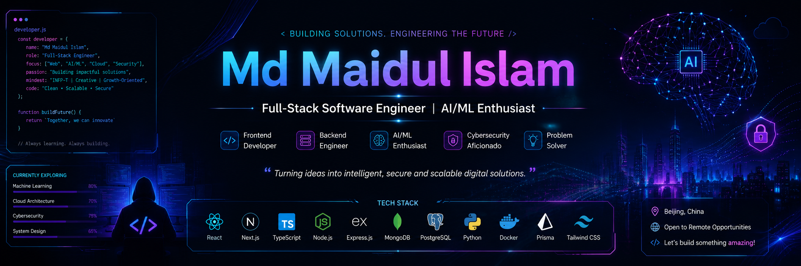

  <p align="center">
  <a href="https://maiduldevs.netlify.app/">
    
  </a>
</p>


<h1 align="center">
  
  Md Maidul Islam
  
</h1>

<h3 align="center">
  Full-Stack Software Engineer • AI/ML Enthusiast
</h3>

<p align="center">
  
</p>

<p align="center">
  <a href="https://git.io/typing-svg">
    
  </a>
</p>

<p align="center">
  
  
  
</p>

<p align="center">
  <a href="mailto:maidulislammanik8991@gmail.com">
    
  </a>
  <a href="tel:+8613161750176">
    
  </a>
  <a href="https://github.com/Dev-Maidul">
    
  </a>
  <a href="https://www.linkedin.com/in/maidul-devs/">
    
  </a>
  <a href="https://maiduldevs.netlify.app/">
    
  </a>
  <a href="https://codeforces.com/profile/Maidul">
    
  </a>
  <a href="https://leetcode.com/u/maidulislammanik8991/">
    
  </a>
  <a href="https://www.upwork.com/freelancers/~01a039892954a8969f?mp_source=share">
    
  </a>
</p>

<br/>

<p align="center">
  
  
  
</p>

---

##  **Professional Summary**

<table align="center">
  <tr>
    <td>
      
    </td>
    <td>
      <ul>
        <li>🎓 Computer Science undergraduate at <strong>China University of Petroleum</strong></li>
        <li>⚡ Strong hands-on experience in <strong>full-stack web development</strong></li>
        <li>👨‍🏫 Experienced <strong>Technical Instructor</strong> (mentored 200+ students)</li>
      </ul>
    </td>
  </tr>
</table>

---

##  **Technical Proficiencies**

### 🧠 AI, Machine Learning & Data Science

<table align="center">
  <tr>
    <td align="center" width="96">
      
      <br>Python
    </td>
    <td align="center" width="96">
      
      <br>NumPy
    </td>
    <td align="center" width="96">
      
      <br>Pandas
    </td>
    <td align="center" width="96">
      
      <br>Matplotlib
    </td>
    <td align="center" width="96">
      
      <br>Seaborn
    </td>
    <td align="center" width="96">
      
      <br>Plotly
    </td>
    <td align="center" width="96">
      
      <br>Streamlit
    </td>
  </tr>
</table>

| **Category** | **Technologies** | **Purpose** |
|-------------|------------------|-------------|
| 🐍 **Core Language** | `Python` | Primary programming language for ML & Data Science |
| 🔢 **Numerical Computing** | `NumPy` | Mathematical operations & array manipulation |
| 📊 **Data Manipulation** | `Pandas` | Data cleaning, transformation & analysis |
| 📈 **Static Visualization** | `Matplotlib` `Seaborn` | Publication-quality statistical graphics |
| 📉 **Interactive Visualization** | `Plotly` | Interactive dashboards & dynamic charts |
| 🚀 **Application Framework** | `Streamlit` | Rapid ML app prototyping & deployment |

---

### 🎨 Frontend Development


### ⚙️ Backend & Databases


### 🔐 Authentication & Security
-000000?style=for-the-badge&logo=auth0&logoColor=white)


### 🚀 DevOps, Cloud & Tools


---

##  **Professional Experience**

<table align="center">
  <tr>
    <td width="50%">
      <h3 align="center">👨‍🏫 Teaching Assistant</h3>
      <p align="center"><strong>China University of Petroleum</strong></p>
      <p align="center"><em>Sep 2023 – Present</em></p>
      <ul>
        <li>📘 Mentored <strong>150+ undergraduate students</strong> in C Programming</li>
        <li>🔍 Conducted debugging sessions & code reviews</li>
        <li>📝 Developed supplementary learning materials & lab exercises</li>
        <li>🤝 Supported faculty with coursework delivery and assessments</li>
      </ul>
    </td>
    <td width="50%">
      <h3 align="center">💻 Independent Full-Stack Developer</h3>
      <p align="center"><strong>Project-Based</strong></p>
      <p align="center"><em>2022 – Present</em></p>
      <ul>
        <li>🚀 Developed <strong>10+ full-stack applications</strong> using MERN & Next.js</li>
        <li>🗄️ Designed RESTful APIs & optimized database schemas</li>
        <li>🔐 Implemented authentication, authorization & role-based access</li>
        <li>☁️ Deployed applications with production-ready configurations</li>
      </ul>
    </td>
  </tr>
</table>

---

##  **Education**

<p align="center">
  
</p>

<h3 align="center">🎓 Bachelor of Science in Computer Science</h3>
<p align="center"><strong>Expected Graduation: 2027</strong></p>

<p align="center">
  
  
  
  
  
  
</p>

---

##  **GitHub Statistics**

<p align="center">
  
  
</p>

<p align="center">
  
</p>

<p align="center">
  
</p>

---

## 🌍 **Languages**

<p align="center">
  
  
  
</p>

---

##  **Current Focus**

```javascript
const currentFocus = {
  technologies: ["Advanced TypeScript", "Cloud Computing (AWS/Azure)"],
  competitiveProgramming: ["Codeforces", "LeetCode"],
  openSource: "Actively contributing to projects",
  learning: "Machine Learning & Data-Driven Applications"
};
```

<p align="center">
  
  
  
  
</p>

---

##  **Open to Opportunities**

<table align="center">
  <tr>
    <td align="center">
      
    </td>
    <td align="center">
      
    </td>
  </tr>
  <tr>
    <td align="center">
      
    </td>
    <td align="center">
      
    </td>
  </tr>
</table>

---

##  **Let's Connect!**

<p align="center">
  <a href="https://github.com/Dev-Maidul">
    
  </a>
  <a href="https://www.linkedin.com/in/maidul-devs/">
    
  </a>
  <a href="mailto:maidulislammanik8991@gmail.com">
    
  </a>
</p>

<p align="center">
  
</p>

<p align="center">
  <strong>💡 "Turning ideas into scalable, secure, and elegant solutions."</strong>
</p>


